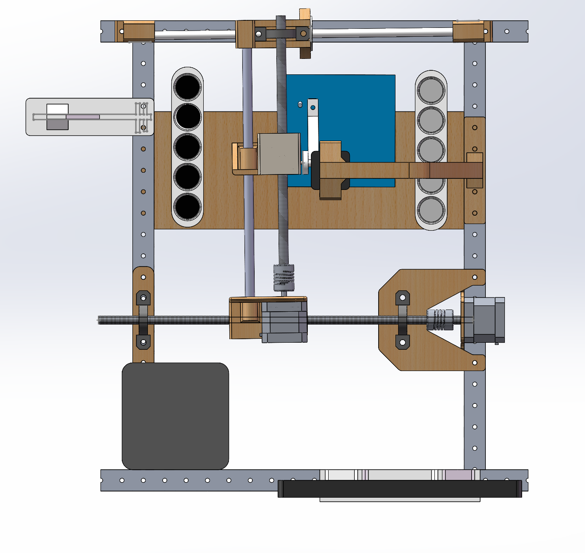

## 下棋AI算法

### min-max 算法
由于我们总可以保证人类这边下棋是下是最优的一步，所以自动任务（第四第五题）的算法使用 **min-max算法**，这是一种递归的算法，一种动态博弈的算法，一种假设人类也在采取最佳行动的情况下确定最佳行动的算法

需要注意的是 min-max 算法并不是最优的算法，因为当对手出现失误的时候，这个算法并没有发现漏洞的能力，可以运行```algorithm_test/min_max.py```算法测试尝试。

例如，这里轮到人类下一个X到第6个格子
<div style="text-align: center;">
	
</div>
AI本可以直接选择第8个就赢了，但是它没有选择第8个，而是选择了第三个
<div style="text-align: center;">
	
</div>

### 强化学习 (Reinforcement Learning)
上述min max算法并不是 optimal solution，动态规划 ( dynamic programming)是一种可以计算最优解的算法，但是需要输入对手的完整状态信息，计算量庞大。

### 标定的9个点的坐标
由于时间上的紧迫性、视觉识别经验不足以及硬件选型上面的失误，我们并不打算做旋转的那题
$$
[ [182, 150]  ,  [398, 155]  ,  [614, 160]  ,  [178, 365]  ,  [394, 369]  ,  [609, 374]  ,  [174, 578]  ,  [390, 583]  ,  [603, 586]  ]
$$


### 两种模式

第四题

HUMAN -1 X 白色
AI     1 O 黑色


第五题(和第四题基本一致，没有写上来)

HUMAN -1 X 黑色
AI     1 O 白色

### 好的开源
但是我们并没有购买这个硬件，思路是很好的
https://gitee.com/linsen06/tic-tac-toe-esports/blob/master/minimax.py

## 硬件设计
实物如下
<div style="text-align: center;">
	
</div>
采用丝杆+步进电机+舵机摆臂设计
<div style="text-align: center;">
	
</div>
<div style="text-align: center;">
	
</div>
<div style="text-align: center;">
	
</div>
步进电机能够轻松实现位置准确控制，摆臂能够轻松实现棋子约90°上下运动，吸棋和放棋的过程中不影响旁边的棋子


### @ TODO
- 看看有没有好的方法实现又能一直开着opencv识别一遍


