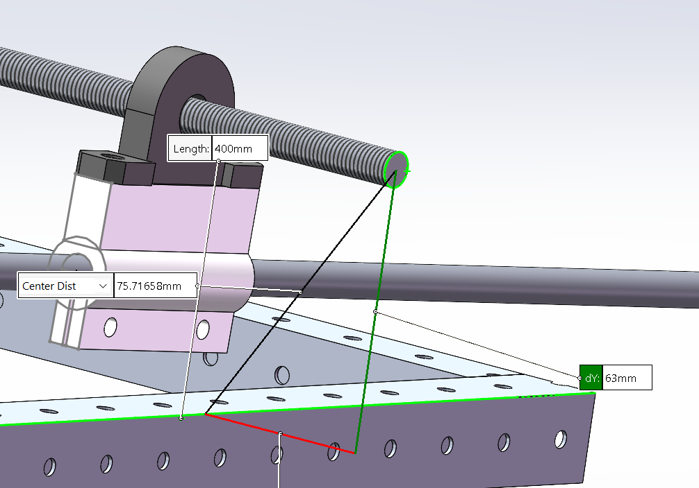
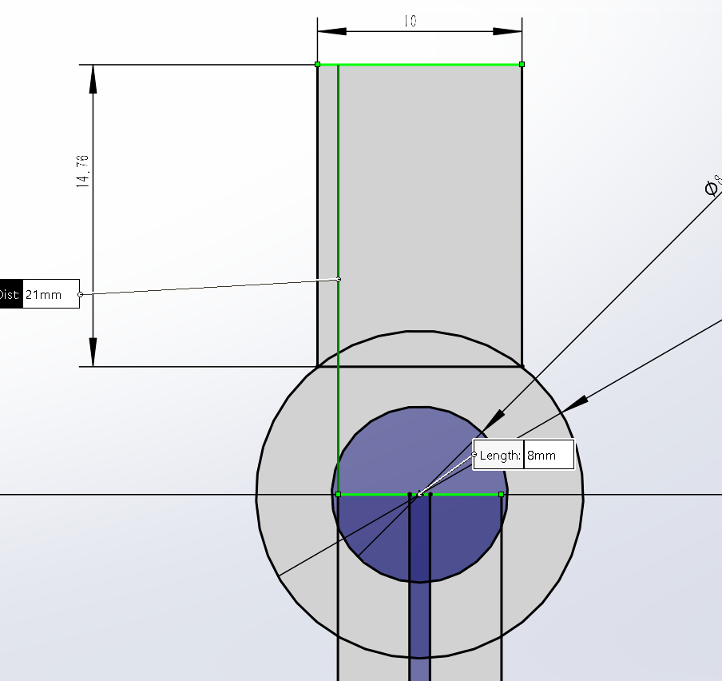
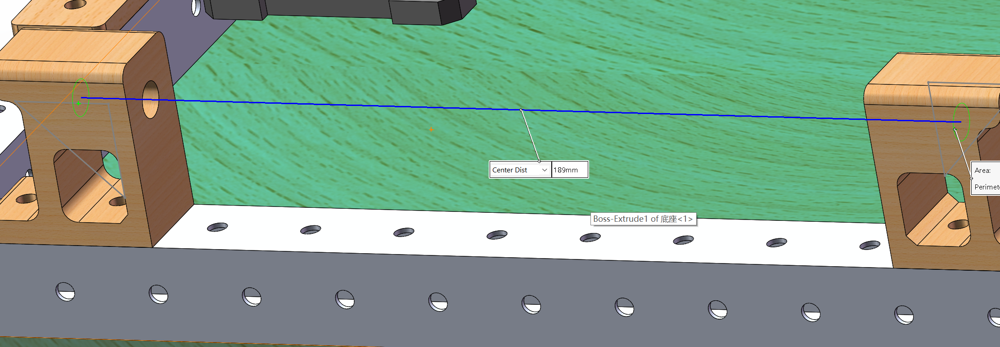
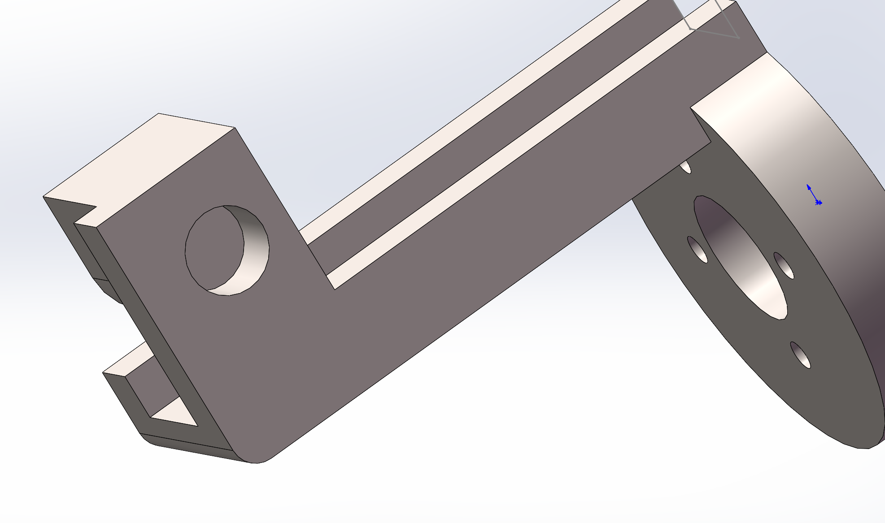
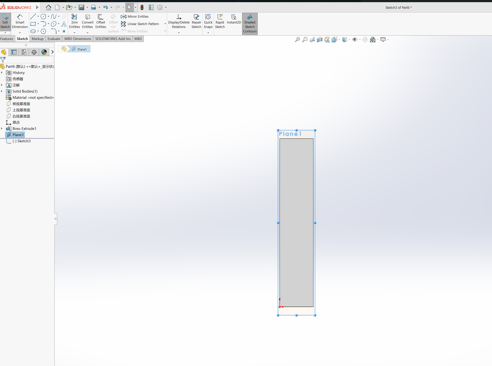
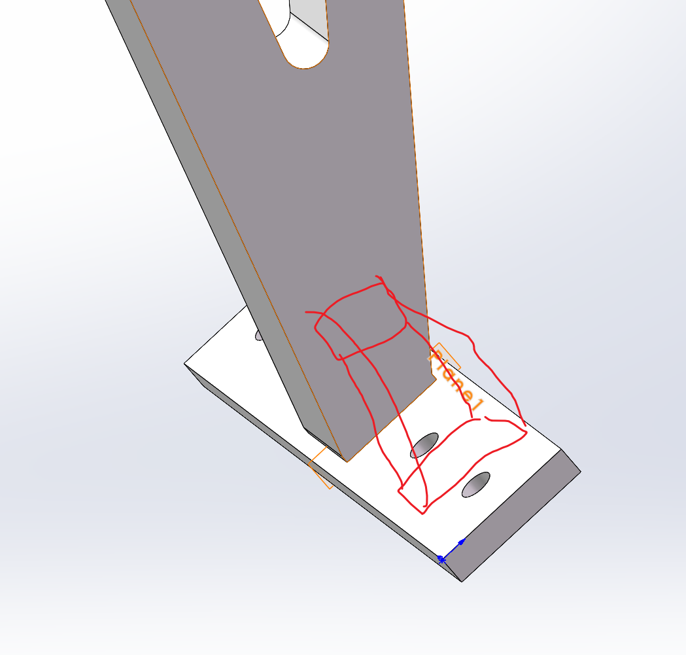
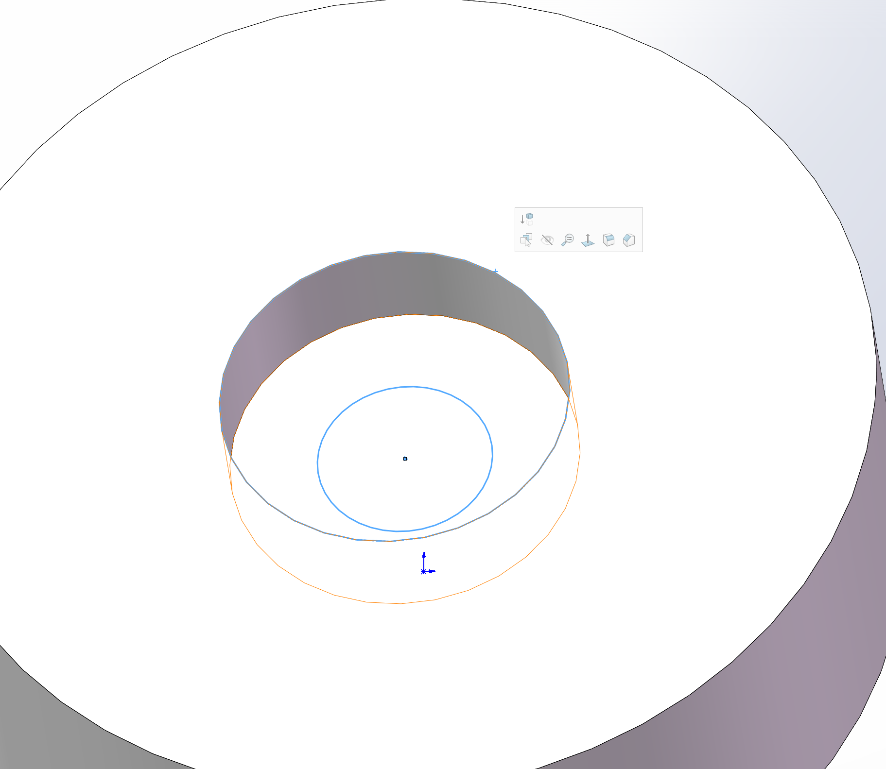

## 拓竹打印机打印参数调整
基于现在已有的打印机的内部的参数
- 打孔加多0.3mm
- 打垫高的平面不用加，打平面一般没有问题

## 棋盘 $\pm 45 \degree$ 旋转之后的最大距离是 
$$
98 \text{ mm} \times \sqrt 2 = 138.572 \text{ mm}

$$
外围的铝方管没有限制，那么就先做大一点

## 一些常数

铝方管

|      | 长度/mm | 
|------|------|
| 孔径 |4 | 
| 孔间距 | 20 | 
| 宽度   | 20 |

2轴孔到铝管距离： 63mm

	

	

<!--  -->

光轴直径: 8.0mm

这个孔深为7mm

	

### 棋子中的铁片的宽度
4.6mm

### @TOASK
- 如何在装配体中打开零件后，查看在装配体中相对位置

- 一打开画草图就不合适的角度。如何转

	

- 直接在两个面之间进行拉伸？

	

- 这个光轴

### 两个面之间拉伸怎么画，化成斜面螺丝
